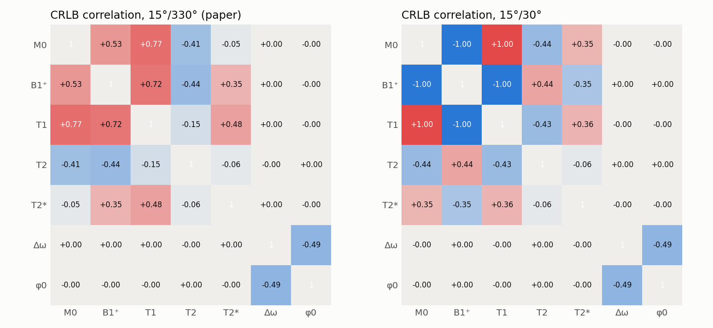
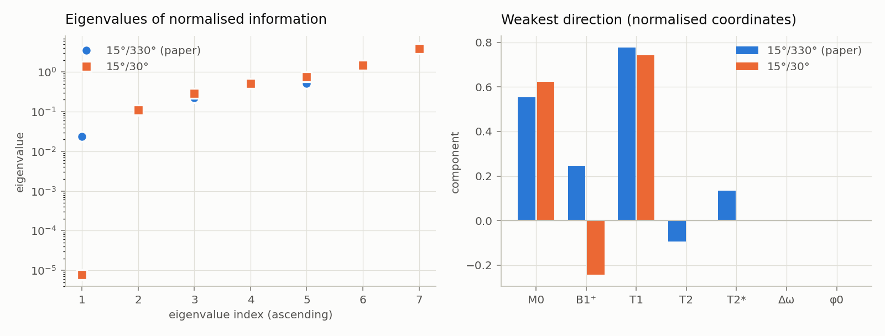
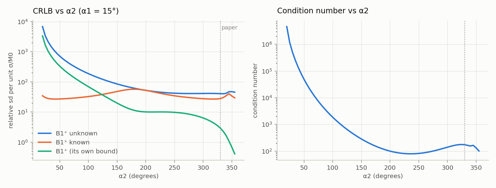
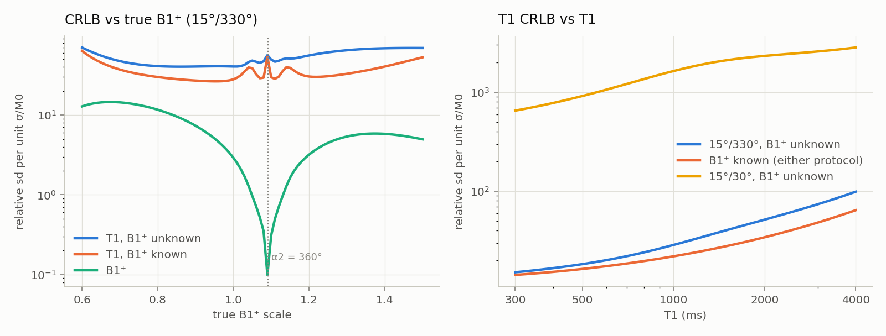
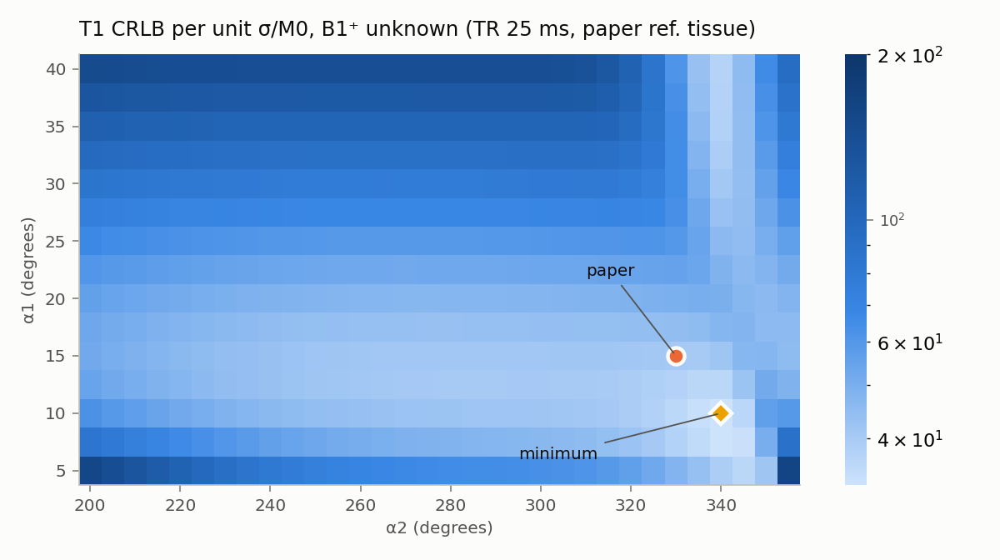

# B1⁺ / T1 in MPME: Cramér–Rao bounds and conditioning

Reproduce with `python scripts/crlb_analysis.py` (≈ 10 s; figures in `docs/figures/`).
Code: `src/mpme/crlb.py`. Tissue unless stated: the paper's reference values
T1/T2/T2* = 1500/70/60 ms, B1⁺ = 1, paper protocol (TR 25 ms, α 15°/330°, pathways
[1, 0, −1], 3 echoes each).

## Summary

1. **The core problem is a near-symmetry of the signal model.** For small flip angles and
   TR ≪ T1, every pathway amplitude is almost unchanged by
   **(M0, B1⁺, T1) → (M0/k, k·B1⁺, T1/k²)**. Because B1⁺ scales *all* flip angles, two
   scans with small nominal angles (e.g. 15°/30°) cannot break it: T1 and B1⁺ come out
   with correlation −0.9999 and a T1 bound ~50× worse than with B1⁺ known.
2. **The paper's 330° pulse breaks the symmetry through the 360° wrap.** Physically
   330° ≡ −30° (with B1⁺ known, the two protocols carry *identical* information), but a B1⁺
   change moves the effective angle 330·B1⁺ − 360° eleven times faster than proportional
   and in the opposite direction. The condition number drops from 5×10⁵ to 173.
3. **What remains is ordinary confounding, not degeneracy.** With the paper protocol the T1
   bound is 40.5·σ/M0. It is built up as: 7.9 (T1 alone) → 21.1 (+ T2, T2*, Δω, φ0) →
   28 (+ M0) → 40.5 (+ B1⁺). B1⁺ now costs a factor 1.45, M0 and the transverse
   relaxation times cost more.
4. **The paper's two-stage design costs precision.** T1 from scan 1 alone with B1⁺ fixed
   has a bound of 57; a 1% error in the smoothed B1⁺ map becomes a −2% T1 bias.
5. **Protocol tuning is a small lever** (best α1/α2 = 10°/340° is 19% better than 15°/330°).
   Bigger levers are estimators that reach the bound (the analytic chain is ~3× above it)
   and spatial priors (B1⁺ is smooth, so it can be treated as nearly known).

---

## 1. Set-up

**Parameters.** θ = (log M0, log B1⁺, log T1, log T2, log T2*, Δω, φ0). Positive
parameters are logged so that √CRLB is a *relative* standard deviation; Δω (rad/ms) and
the global phase φ0 (rad) are nuisance parameters. R2′ = 1/T2* − 1/T2.

**Data and noise.** All 2 scans × 3 pathways × 3 echoes, complex, each with circular
Gaussian noise of standard deviation σ per real/imaginary part:

    F = (1/σ²) · Σ Re(∂S/∂θ)ᴴ (∂S/∂θ),        Cov(θ̂) ⪰ F⁻¹   (unbiased estimators)

Jacobians come from autograd through the differentiable EPG/isochromat model and are
checked against finite differences in `tests/test_crlb.py`.

**Units.** σ is expressed in units of M0, so every bound scales as σ/M0 = 1/SNR(M0).
Numbers below are "relative sd per unit σ/M0": divide by SNR(M0). The brightest MPME image
has |S| ≈ 0.088·M0, so **image SNR ≈ 0.088 × SNR(M0)** (e.g. image SNR 50 ↔ SNR(M0) ≈ 570).

**Conditioning tools.**
- *Normalised information* D^{-1/2} F D^{-1/2} (D = diag F): unit diagonal, unit-free.
  Its smallest eigenvalue and eigenvector are the worst-determined parameter combination.
- *Variance inflation* (F⁻¹)ᵢᵢ·Fᵢᵢ: factor by which the bound on θᵢ grows because the other
  parameters are unknown (1 = no confounding).
- *Fixed-parameter bias* −F_rr⁻¹ F_r,j: shift of the fitted parameters per unit error in
  a parameter j that is held fixed at a wrong value.

## 2. The fundamental issue: a scaling symmetry

### Derivation

Take the closed-form fully dephased FISP (pathway 0) and PSIF (pathway −1) amplitudes
(verified against the simulator in the tests):

    F_0  = tan(α/2) · [1 − (E1 − cos α)(1 − E2²)/r]
    F_−1 = tan(α/2) · [1 − (1 − E1 cos α)(1 − E2²)/r] / E2
    r² = p² − q²,  p = 1 − E1 cos α − E2²(E1 − cos α),  q = E2(1 − E1)(1 + cos α)

Write ρ = TR/T1. For α ≪ 1 rad and ρ ≪ 1, to leading order

    E1 − cos α ≈ α²/2 − ρ,    1 − E1 cos α ≈ ρ + α²/2,    1 − E1 ≈ ρ,
    p ≈ (ρ + α²/2) − E2²(α²/2 − ρ),    q ≈ 2 E2 ρ.

Every one of these is **homogeneous of degree 1 in (ρ, α²)**, so all the brackets depend
only on the ratio α²/ρ = α²·T1/TR, and the only remaining α-dependence is the prefactor
tan(α/2) ≈ α/2. Hence

    S(M0/k, k·α, T1/k²) ≈ S(M0, α, T1)        for every pathway and echo,

independent of T2 (E2 is untouched). The same holds for the familiar spoiled-GRE intuition
(S ≈ M0·α·ρ/(ρ + α²/2)) and, numerically, for the higher pathways.

Since the actual flip angle is B1⁺·α_nom, scaling every flip angle by k **is** a B1⁺
change. In log coordinates the near-null direction is

    (Δlog M0, Δlog B1⁺, Δlog T1) ∝ (−1, +1, −2).

Acquiring a second scan with a different *small* nominal angle does not help: both angles
scale by the same k, so the symmetry survives. This is the classical B1-sensitivity of
variable-flip-angle T1 mapping (T1_apparent ∝ T1/B1²).

### Numerical confirmation (15°/30°)

- Fixing B1⁺ wrong by ε and fitting everything else shifts **T1 by −2.06 ε and M0 by
  −1.02 ε** (the prediction is −2 and −1).
- CRLB correlations: B1⁺–T1 −0.9999, B1⁺–M0 −0.9999, T1–M0 +0.9999.
- Smallest normalised eigenvalue 7.7×10⁻⁶ (condition number 5×10⁵); variance inflation
  72 000 for T1, 51 000 for M0, 7 700 for B1⁺; T2, T2*, Δω are unaffected (≈ 1–6).
- Moving 1% along the symmetry changes the signal by 1.4×10⁻⁴ (relative norm), versus
  1.2×10⁻² for a 2% change of T1 alone — the data are ~80× less sensitive along it:

| k − 1 | 15°/330° | 15°/30° | T1 alone by k⁻² (15°/30°) |
|---|---|---|---|
| 0.01 | 3.6×10⁻² | 1.4×10⁻⁴ | 1.2×10⁻² |
| 0.02 | 7.1×10⁻² | 2.9×10⁻⁴ | 2.4×10⁻² |
| 0.05 | 1.7×10⁻¹ | 7.4×10⁻⁴ | 5.9×10⁻² |

### Why 330° works

|F(α)| is even and 2π-periodic in α, so 330° produces the same magnitudes as 30° (only the
sign of the k ≥ 0 / k < 0 states flips). With B1⁺ known, **15°/330° and 15°/30° give
identical bounds for every parameter** (tested). The difference appears only in the B1⁺
derivative:

    α2,eff = 330°·B1⁺ − 360°  ≈ −30°,      d log|α2,eff| / d log B1⁺ = 330/(330 − 360) = −11,

while α1 scales with exponent +1. The symmetry needs every angle to scale by the same k;
here α2,eff moves 11× faster and in the opposite direction, so the null direction is
lifted. The near-360° pulse is effectively a built-in B1⁺ measurement.

## 3. Bounds

Per unit σ/M0 (relative sd; Δω in rad/ms).

| Protocol | Tissue (T1/T2/T2*) | Scenario | M0 | B1⁺ | T1 | T2 | T2* | Δω |
|---|---|---|---|---|---|---|---|---|
| 15°/330° | WM (850/66/50) | all unknown | 12.5 | 2.21 | 27.3 | 16.0 | 27.2 | 0.30 |
| 15°/330° | WM | B1⁺ known | 11.5 | — | 21.4 | 15.8 | 27.0 | 0.30 |
| 15°/330° | GM (1350/90/60) | all unknown | 14.7 | 2.75 | 33.1 | 20.7 | 38.2 | 0.31 |
| 15°/330° | GM | B1⁺ known | 13.2 | — | 25.4 | 20.0 | 37.4 | 0.31 |
| 15°/330° | Paper ref. (1500/70/60) | all unknown | 19.0 | 2.91 | 40.5 | 23.1 | 47.3 | 0.37 |
| 15°/330° | Paper ref. | B1⁺ known | 16.1 | — | 28.0 | 20.7 | 44.2 | 0.37 |
| 15°/30° | Paper ref. | all unknown | 1050 | 1020 | 2110 | 23.1 | 47.3 | 0.37 |
| 15°/30° | Paper ref. | B1⁺ known | 16.1 | — | 28.0 | 20.7 | 44.2 | 0.37 |

T2* is poorly determined in *relative* terms because R2′ is small here (T2* = 60 vs
T2 = 70 ms); T2 and Δω do not depend on the B1⁺ question at all.

## 4. Conditioning with the paper protocol

| | 15°/330° | 15°/30° |
|---|---|---|
| Normalised eigenvalues | 0.024, 0.11, 0.22, 0.51, 0.52, 1.49, 4.13 | 7.7×10⁻⁶, 0.11, 0.29, 0.51, 0.76, 1.49, 3.84 |
| Condition number | 173 | 5.0×10⁵ |
| Variance inflation M0 / B1⁺ / T1 | 16.7 / 4.6 / 26.6 | 51 000 / 7 700 / 72 000 |
| d log T1 / d log B1⁺ (B1⁺ fixed wrong, all data) | +10.1 | −2.06 |
| d log T1 / d log B1⁺ (B1⁺ fixed wrong, scan 1 only) | −2.02 | −2.02 |

The weakest direction of the paper protocol is still mostly **M0 and T1 moving together**
(components 0.56 and 0.78, B1⁺ only 0.25): a longer T1 lowers all steady-state amplitudes,
which a larger M0 can largely compensate. The hierarchy of the T1 bound shows where
precision goes:

| Unknown | T1 bound |
|---|---|
| T1 only | 7.9 |
| + T2, T2*, Δω, φ0 | 21.1 |
| + M0 | 28.0 |
| + B1⁺ (15°/330°) | 40.5 |
| + B1⁺ (15°/30°) | 2110 |

With the paper protocol, B1⁺ is no longer the main problem: T1 is weakly encoded at
α1 = 15°, TR = 25 ms (T1 ≫ TR), and is confounded mostly with T2/T2* and M0.

Note the sign flip of the fixed-B1⁺ bias with all data (+10): if a wrong B1⁺ is imposed,
scan 1 and scan 2 disagree and the fit compensates in large, unphysical ways. Supplying an
externally estimated B1⁺ to a joint fit (or to a network) therefore amplifies B1⁺ errors
by ~10×, unless the high-flip data are left out of the T1 step as the paper does
(then the factor is the benign −2).

## 5. Sweeps

- **α2 (α1 = 15°).** The T1 bound with B1⁺ unknown falls steeply as α2 grows and, from
  α2 ≈ 210° on, stays within 1.5× of the B1⁺-known bound (41–49 for 210°–350°).
  The B1⁺ bound keeps improving towards 360° (2.9 at 330°, 0.68 at 350°).

- **True B1⁺ (paper protocol).** Over a 3T-typical B1⁺ range 0.7–1.3 the T1 bound stays
  between 40 and 65. Near α2,eff = 360° (B1⁺ ≈ 1.09) B1⁺ is determined *best* (bound
  ≈ 0.1–0.3), because the scan-2 signal passes through zero and its magnitude is extremely
  B1⁺-sensitive; T1 gets slightly worse there because scan 2 carries almost no signal.
  The difficulty at 360° is global, not local: magnitudes cannot tell 360° − x from
  360° + x, and the sign of the scan-2 FID that resolves this vanishes at 360°.
- **T1.** Relative T1 precision degrades with T1 (bound 15 at 300 ms, 100 at 4000 ms):
  long-T1 tissue (CSF, lesions) is hardest.

- **(α1, α2) map.** For α1 = 15° the best α2 is 335° (bound 40.2, essentially the paper's
  choice). The global optimum on this grid is 10°/340° (32.9), 19% better. Very small α1
  or α2 → 360° degrade quickly.

## 6. Which pathways matter

| Pathways | B1⁺ | T1 | T1 (B1⁺ known) | T2 | condition |
|---|---|---|---|---|---|
| (1, 0, −1) | 2.91 | 40.5 | 28.0 | 23.1 | 173 |
| (0, −1) | 5.31 | 67.0 | 30.7 | 26.5 | 527 |
| (1, 0) | 5.08 | 146 | 132 | 208 | 1 920 |

The +1 pathway is worth a factor 1.65 on T1 (mostly via B1⁺); the echo pathway −1 is
essential (without it T2 and T1 collapse), consistent with the paper's derivation.

## 7. The paper's two-stage strategy

The paper estimates B1⁺ at low resolution (scan 2 covers 25% × 25% of ky–kz), smooths it
with a polynomial, then computes T1 voxel-wise from scan 1 only (Eqs. 16–17).

- **B1⁺ stage.** At the low resolution both scans have ~4× the per-voxel SNR (16× voxel
  volume, 1/16 of the samples), so the B1⁺ bound is 2.91/4 = 0.73 per low-res voxel,
  further reduced by spatial smoothing.
- **T1 stage.** With B1⁺ treated as known and scan 1 only, the T1 bound is **57**
  (T2: 40.6), versus 40.5 for a joint fit with scan 2 at full resolution, which the
  paper's design does not acquire.
- **Error transfer.** d log T1 / d log B1⁺ = −2.02 in this stage: a 1% bias in the smoothed
  B1⁺ map gives a 2% T1 bias. Total T1 variance ≈ (57² + 2.02²·Var(log B1⁺)/(σ/M0)²)·(σ/M0)².

## 8. What this means in practice

| SNR(M0) | Image SNR (peak) | T1 sd, joint (40.5) | T1 sd, paper T1 stage (57) | ROI of 100 voxels (joint) |
|---|---|---|---|---|
| 300 | 26 | 13.5% | 19% | 1.4% |
| 1000 | 88 | 4.1% | 5.7% | 0.4% |
| 3000 | 264 | 1.4% | 1.9% | 0.1% |

(Bounds for unbiased estimators; the analytic pipelines reach roughly 3× these values in
simulation, see `docs/plan.md`.)

Implications for the neural-network work:

1. **No per-voxel estimator can beat these numbers.** The realistic per-voxel gain over the
   analytic chain is the ~3× gap to the bound, which a well-trained network (or a joint
   maximum-likelihood fit) can close.
2. **Spatial priors are where larger gains are.** B1⁺ is smooth: estimating it at low
   resolution and treating it as nearly known removes its factor 1.45. M0 and T1 are not
   smooth, so their confounding (factor ~1.3 from M0, ~2.7 from T2/T2*) must be handled by
   learned image priors (Level B in the plan).
3. **Be careful feeding B1⁺ into a joint estimator**: with all data, a B1⁺ error is
   amplified ~10× into T1 (section 4).
4. **Protocol optimisation** with these tools is cheap; gains are modest for flip angles
   (≤ 20%) but TR, echo placement and the scan-2 coverage are still open.

## Caveats

- The CRLB is local: it assumes the model is exact, Gaussian noise and unbiased
  estimators. It does not see the global 360° branch ambiguity.
- Complex data with explicit Δω and φ0 nuisance parameters are assumed; the paper's
  magnitude-based processing discards phase and can only do worse.
- Both scans are treated at full resolution except in section 7.
- Instantaneous RF (no Eq. 8 nutation effects), Lorentzian R2′, no diffusion, no MT.
